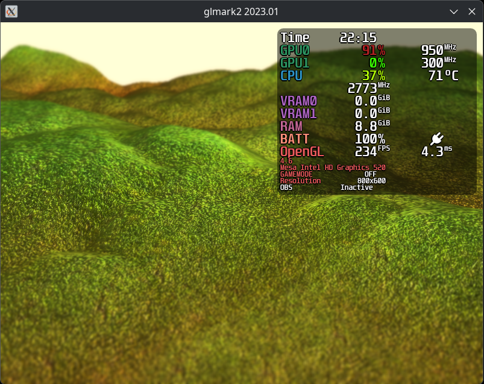
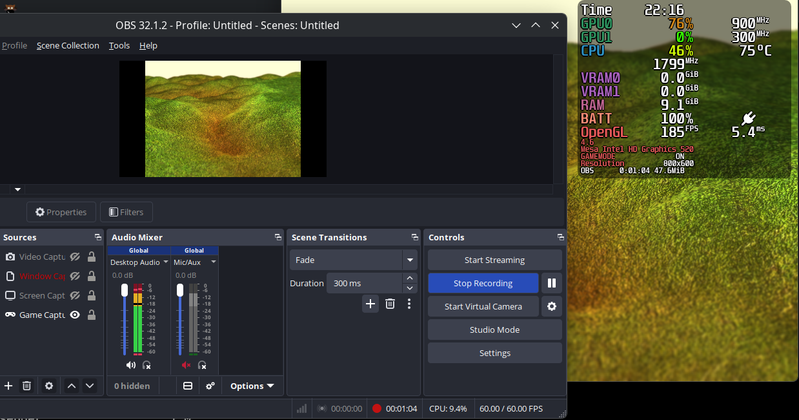

# MangoHUD_OBS
a reimplementation of [my MangoHud obs branch](https://github.com/Denzy7/MangoHud/tree/obs) to work with an exec config option

# limitations
unlike the plugin, it doesn't save the exe path and remove shared memory from /dev/shm. formatting is not possible

# build with cmake
```
cmake -S . -B build
cmake --build build
sudo cmake --install build
```

# usage
```
#MangoHud.conf
legacy_layout=0
custom_text=OBS
# get the path if the built binary with running: realpath build/MangoHud_OBS_getstats
exec=<absolute-path-to-MangoHud_OBS_getstats>
```  
open obs to test
  
  
